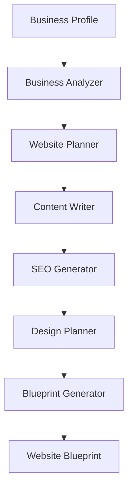

# AI Generation Pipeline

This package defines the asynchronous, provider-neutral pipeline that converts a business profile into the shared Website Blueprint. It contains contracts, orchestration, retry/error infrastructure, prompt abstractions, and deliberately unconfigured placeholder services. It does **not** call an AI model.

## Pipeline



The orchestrator executes stages sequentially because each output is typed input to later stages. A renderer can consume the final builder-neutral blueprint without knowing which provider produced it.

## Dependency architecture

```mermaid
flowchart LR
    App[Application composition root] --> Pipeline[AsyncGenerationPipeline]
    App -. injects .-> Analyzer[BusinessAnalyzer]
    App -. injects .-> Planner[WebsitePlanner]
    App -. injects .-> Writer[ContentWriter]
    App -. injects .-> SEO[SeoGenerator]
    App -. injects .-> Designer[DesignPlanner]
    App -. injects .-> Generator[BlueprintGenerator]
    App -. injects .-> Logger[PipelineLogger]
    App -. injects .-> Retry[RetryPolicy]
    Pipeline --> Analyzer
    Pipeline --> Planner
    Pipeline --> Writer
    Pipeline --> SEO
    Pipeline --> Designer
    Pipeline --> Generator
    Generator --> Shared[@website-generator/shared schema]
```

## Modules

- `analyzer` defines business input and normalized analysis contracts.
- `planner` defines the information architecture and semantic page/section plan.
- `writer` defines page content and SEO generation contracts.
- `designer` defines semantic visual direction without CSS or builder settings.
- `orchestrator` coordinates stages and provides logging, typed errors, cancellation, and retry primitives.
- `prompts` defines versioned, provider-neutral prompt templates and a registry. Prompt content will be added alongside provider adapters.

## Composition

Every stage is constructor-injected. Provider adapters can therefore be replaced independently, and tests can use fakes without network calls.

```ts
import { AsyncGenerationPipeline } from '@website-generator/ai/orchestrator';

const pipeline = new AsyncGenerationPipeline({
  analyzer,
  planner,
  writer,
  seoGenerator,
  designer,
  blueprintGenerator,
  logger,
  retryPolicy,
});

const result = await pipeline.generate({
  profile,
  signal: abortController.signal,
});
```

The exported `Unconfigured*` implementations fail explicitly and are safe placeholders until concrete adapters are registered. They never fabricate content or make external requests.

## Failure and retry behavior

Each failed stage is wrapped in `PipelineStageError`, including the run ID, stage, attempt count, and original cause. Cancellation produces `PipelineAbortedError`. `RetryPolicy` controls attempt count, delay, and retry eligibility; the default uses capped exponential backoff. Applications should inject a policy that retries only transient provider and transport failures. A `Sleeper` abstraction keeps retry behavior deterministic in tests.

Logging is vendor-neutral through `PipelineLogger`. Events contain structured `runId`, `stage`, and `attempt` context, while the default logger is intentionally silent. Avoid placing business secrets, complete prompts, or generated content in log context.

## Adding an AI provider later

1. Implement one or more stage interfaces in an adapter package.
2. Translate the neutral `PromptMessage` contract into the provider request format.
3. Validate provider responses before returning stage output.
4. Inject adapters at the application composition root.
5. Configure transient-error classification, rate limits, timeouts, and observability.

Provider SDK types and response formats must not leak into these contracts.
