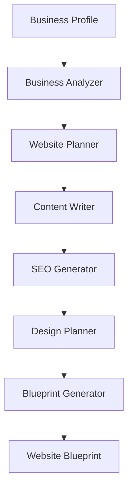

# AI Generation Pipeline

This package defines the asynchronous, provider-neutral pipeline that converts a business profile into the shared Website Blueprint. It includes deterministic mock adapters and a server-only OpenAI adapter using the official JavaScript SDK and Zod structured outputs.

## Providers

`AI_PROVIDER=mock` is the default when unset and performs no network I/O. Set
`AI_PROVIDER=openai` at the server to enable OpenAI and configure
`OPENAI_API_KEY`, `OPENAI_MODEL`, `OPENAI_TIMEOUT_MS`, and
`OPENAI_MAX_RETRIES`. Never prefix these variables with `NEXT_PUBLIC_` or import
the provider into a client component. The dashboard `POST /api/generations`
route is the server-side composition boundary.

The OpenAI provider implements analysis, sitemap planning, conversion copy,
local SEO, semantic design planning, and builder-neutral blueprint generation.
Every response is parsed as a structured output and validated by Zod. The SDK
handles transient retries and rate limits; timeouts, refusals, malformed output,
authentication failures, and provider failures are converted to safe messages.
Token usage is available on `provider.client.usage` when returned by OpenAI.

## Pipeline



The orchestrator executes stages sequentially because each output is typed input to later stages. A renderer can consume the final builder-neutral blueprint without knowing which provider produced it.

## Dependency architecture

```mermaid
flowchart LR
    App[Application composition root] --> Pipeline[AsyncGenerationPipeline]
    App -. injects .-> Analyzer[BusinessAnalyzer]
    App -. injects .-> Planner[WebsitePlanner]
    App -. injects .-> Writer[ContentWriter]
    App -. injects .-> SEO[SeoGenerator]
    App -. injects .-> Designer[DesignPlanner]
    App -. injects .-> Generator[BlueprintGenerator]
    App -. injects .-> Logger[PipelineLogger]
    App -. injects .-> Retry[RetryPolicy]
    Pipeline --> Analyzer
    Pipeline --> Planner
    Pipeline --> Writer
    Pipeline --> SEO
    Pipeline --> Designer
    Pipeline --> Generator
    Generator --> Shared[@website-generator/shared schema]
```

## Modules

- `analyzer` defines business input and normalized analysis contracts.
- `planner` defines the information architecture and semantic page/section plan.
- `writer` defines page content and SEO generation contracts.
- `designer` defines semantic visual direction without CSS or builder settings.
- `orchestrator` coordinates stages and provides logging, typed errors, cancellation, and retry primitives.
- `prompts` defines versioned, provider-neutral prompt templates and a registry. Prompt content will be added alongside provider adapters.

## Composition

Every stage is constructor-injected. Provider adapters can therefore be replaced independently, and tests can use fakes without network calls.

```ts
import { AsyncGenerationPipeline } from '@website-generator/ai/orchestrator';

const pipeline = new AsyncGenerationPipeline({
  analyzer,
  planner,
  writer,
  seoGenerator,
  designer,
  blueprintGenerator,
  logger,
  retryPolicy,
});

const result = await pipeline.generate({
  profile,
  signal: abortController.signal,
});
```

## Project generation orchestrator

`WebsiteGenerationOrchestrator` is the application-facing coordinator. It loads a
business profile by project ID and runs the six provider-neutral stages. The
convenience `generateWebsite(projectId)` function delegates to dependencies
registered once with `configureWebsiteGenerator` at the application composition
root.

```ts
import {
  configureWebsiteGenerator,
  generateWebsite,
} from '@website-generator/ai/orchestrator';

configureWebsiteGenerator({
  projects,
  analyzer,
  planner,
  writer,
  seoGenerator,
  designer,
  blueprintGenerator,
  reporter,
  logger,
  metrics,
  defaultTimeoutMs: 30_000,
  stages: {
    writing: { timeoutMs: 60_000, retryPolicy: writingRetryPolicy },
  },
});

const result = await generateWebsite(projectId);
```

### Lifecycle and progress

The reporter receives typed `GenerationEvent` values in lifecycle order:

1. `generation.started`
2. `stage.started`
3. optionally, `stage.retrying` followed by another `stage.started`
4. `stage.completed` (or terminal `stage.failed`)
5. `generation.completed`

Every event includes a `GenerationProgress` snapshot with the project and run
identifiers, current `GenerationStage`, attempt, completed/total stage counts,
percentage, status, and timestamp. Reporter calls are awaited, preserving event
ordering and allowing a queue-backed adapter to provide durable delivery.

Each stage has its own retry and timeout configuration. A failed attempt reruns
only that stage; completed upstream work remains in the run state. Timeouts abort
the provider's signal and surface as a `StageTimeoutError` wrapped by
`PipelineStageError`. Providers should honor the supplied `AbortSignal` and must
be safe to invoke more than once.

### Observability and test providers

`PipelineLogger` receives structured context (`projectId`, `runId`, `stage`,
`attempt`, durations, and retry delays) without generated content or secrets.
`GenerationMetrics` records stage completions, failures, retries, and total run
duration through a vendor-neutral port. Both default to no-op implementations.

`MockAiProvider` exposes deterministic adapters for every stage, records calls,
and can fail selected attempts with `failNext`. It is intended for tests and local
development and never performs network I/O.

The exported `Unconfigured*` implementations fail explicitly and are safe placeholders until concrete adapters are registered. They never fabricate content or make external requests.

## Failure and retry behavior

Each failed stage is wrapped in `PipelineStageError`, including the run ID, stage, attempt count, and original cause. Cancellation produces `PipelineAbortedError`. `RetryPolicy` controls attempt count, delay, and retry eligibility; the default uses capped exponential backoff. Applications should inject a policy that retries only transient provider and transport failures. A `Sleeper` abstraction keeps retry behavior deterministic in tests.

Logging is vendor-neutral through `PipelineLogger`. Events contain structured `runId`, `stage`, and `attempt` context, while the default logger is intentionally silent. Avoid placing business secrets, complete prompts, or generated content in log context.

## Adding another AI provider

1. Implement one or more stage interfaces in an adapter package.
2. Translate the neutral `PromptMessage` contract into the provider request format.
3. Validate provider responses before returning stage output.
4. Inject adapters at the application composition root.
5. Configure transient-error classification, rate limits, timeouts, and observability.

Provider SDK types and response formats must not leak into these contracts.
